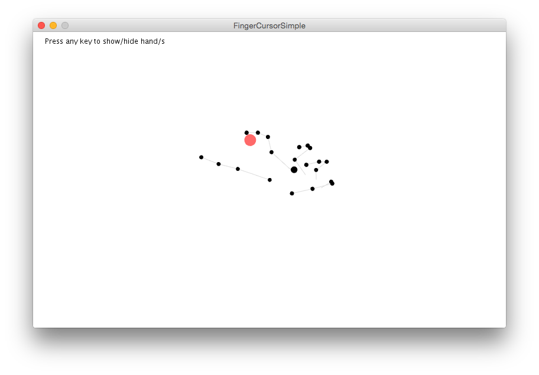

# Interaction Lab / Gesture

[Processing](http://processing.org) programs that showcase gesture-based interaction techniques. These programs are being developed for the Interaction Lab at Augsburg University
of Applied Sciences.

Also see the lecture notes for Interaction Engineering: http://michaelkipp.de/interaction

## FingerCursorSimple

Requires the library "Leap Motion for Processing" (author: Darius Morawiec).

This program takes the x/y coordinates of the index finger and draws a red
cursor at this position.

Pressing any key on the keyboard switches on/off the visualization of the
hand/s.

